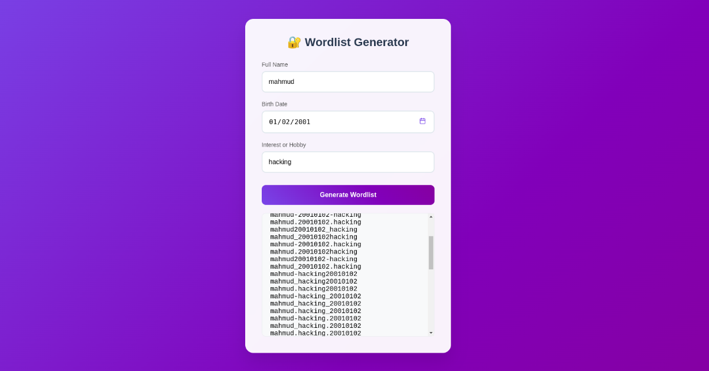

# Wordlist Generator

A Flask web application that generates custom wordlists by combining personal information using AI.

## ⚠️ Important Notice

**This tool is intended for legitimate security purposes only:**
- Password strength testing for your own accounts
- Security research and penetration testing (with proper authorization)
- Educational purposes in cybersecurity training

**Do not use this tool for:**
- Unauthorized access to accounts or systems
- Attacking passwords you don't own
- Any malicious or illegal activities

By using this software, you agree to use it responsibly and in compliance with all applicable laws.

## Features

- Web-based interface for easy use
- AI-powered wordlist generation using Groq API
- Combines name, birth year, and interests with separators
- Generates multiple password variations and permutations



## Requirements

- Python 3.x
- Flask
- A Groq API key

## Installation

1. Clone the repository
2. Install dependencies:
   ```bash
   pip install -r requirements.txt
   ```
3. Create a `.env` file and add your Groq API key:
   ```
   GROQ_API_key=your_api_key_here
   ```

## Usage

1. Run the application:
   ```bash
   python app.py
   ```
2. Open your browser to `http://localhost:5000`
3. Enter a name, birth date, and interest
4. Click "Generate Wordlist" to see AI-generated combinations

## Version

This is version 1.0 - a basic implementation with core functionality.
